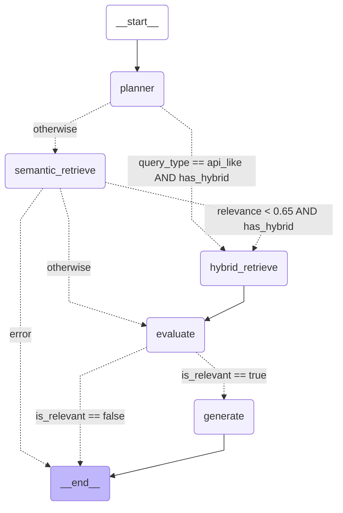
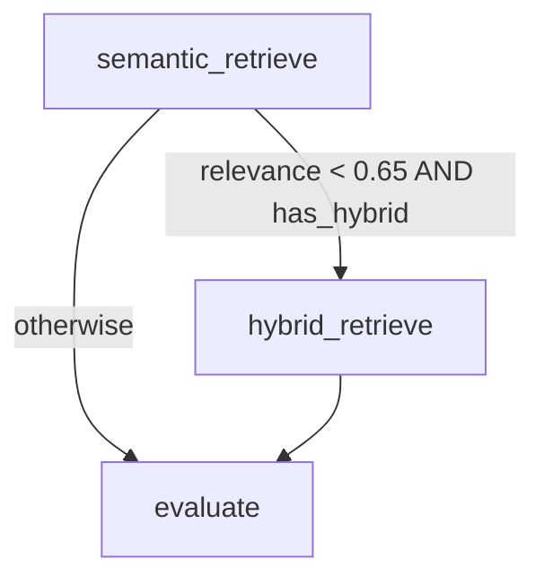
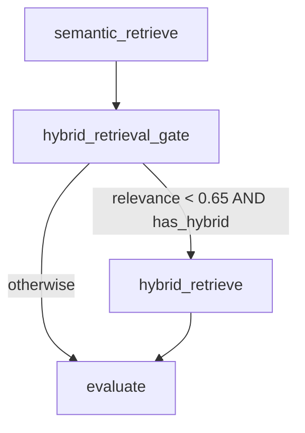
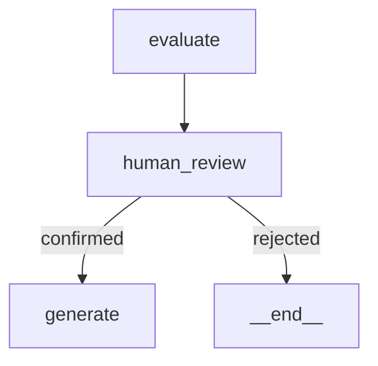
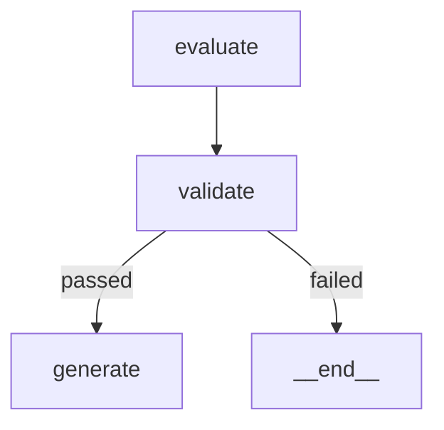

# REF: LangGraph Orchestration Essentials

> Practical reference for designing, implementing, and operating LangGraph workflows in production-style RAG systems.

---

## 1) Core Principle

Model orchestration as a **state machine**:

- **State** is the single source of truth for request lifecycle data.
- **Nodes** perform one focused unit of work and return partial state updates.
- **Edges** define flow; **conditional edges** branch by state.
- Keep orchestration separate from domain logic.

**Terminology note:**
- An **edge** is a connection from one node to another.
- A **branch** is the decision point where one of several **conditional edges** is chosen.

So in practice, a branch is implemented using `add_conditional_edges(...)`.

In practice:
- Use LangChain for LLM/retrieval primitives.
- Use LangGraph for control flow, routing, retries, and traceability.

---

## 2) Mental Model

```
START
  ↓
planner
  ├─ semantic path
  └─ hybrid path
  ↓
evaluate
  ├─ generate
  └─ finish (graceful reject)
  ↓
END
```

This pattern scales naturally to retry loops, tool-use branches, and human-in-the-loop checkpoints.

---

## 3) Minimum Building Blocks

### A. Typed State

Define state with only fields needed for flow decisions + outputs.

```python
from typing import TypedDict, List, Dict, Any

class RAGState(TypedDict, total=False):
    query: str
    collection: str
    top_k: int

    planned_strategy: str
    query_type: str
    decision_path: List[str]

    retrieval_result: Dict[str, Any]
    documents: List[Dict[str, Any]]
    relevance_score: float
    is_relevant: bool

    answer: str
    sources: List[Dict[str, Any]]
    error: str
```

### B. Node Contract

Each node:
- reads state
- performs one task
- returns partial updates (do not mutate global state)

### C. Routing Functions

Routing functions read state and return branch labels. Keep deterministic where possible.

Example:

```python
graph.add_conditional_edges(
  "evaluate",
  route_after_evaluate,
  {
    "generate": "generate",
    "finish": END,
  },
)
```

Here:
- the **branch** happens at `evaluate`
- the outgoing **conditional edges** are `generate` and `finish`
- the router decides which edge to follow

---

## 4) Canonical Workflow to Implement

1. Define state schema (`TypedDict`).
2. Implement nodes (`planner`, `retrieve`, `evaluate`, `generate`).
3. Add `START -> first_node` edge.
4. Add conditional edges for branch decisions.
5. Compile graph.
6. Invoke with initial state per request.
7. Log decision path and key metrics.
8. Add retries/fallbacks only where needed.

---

## 5) Minimal Skeleton

```python
from langgraph.graph import StateGraph, START, END


graph = StateGraph(RAGState)
graph.add_node("planner", planner_node)
graph.add_node("retrieve", retrieve_node)
graph.add_node("evaluate", evaluate_node)
graph.add_node("generate", generate_node)

graph.add_edge(START, "planner")
graph.add_edge("planner", "retrieve")
graph.add_edge("retrieve", "evaluate")

graph.add_conditional_edges(
    "evaluate",
    route_after_evaluate,   # returns "generate" or "finish"
    {
        "generate": "generate",
        "finish": END,
    },
)

graph.add_edge("generate", END)
app = graph.compile()

result = app.invoke({
    "query": "What is IDataTableProps?",
    "collection": "fastapi_docs",
    "top_k": 5,
    "decision_path": [],
})
```

---

## 6) Planner Design Options

### Rule-based planner (recommended first)

Pros:
- deterministic
- low latency/cost
- easy to test

Use for:
- query-shape routing (`api_like` vs `general`)
- first-pass strategy selection (`semantic_first` vs `hybrid_first`)

### LLM-based planner (next step)

Pros:
- handles fuzzy intent and ambiguous queries better

Trade-offs:
- non-determinism
- extra latency/cost
- requires stricter output schema and guardrails

Migration pattern:
- keep node interface stable (`planner_node(state) -> partial_state`)
- swap internals from rules to structured LLM output

---

## 7) Reliability Patterns

- Add explicit `error` in state and route to `finish` safely.
- Add capped retry counter (`attempts < N`) for loops.
- Prefer graceful rejection over low-confidence hallucination.
- Keep fallback logic as graph edges, not scattered `try/except` branches.

---

## 8) Observability Checklist

Track and log at minimum:

- `planned_strategy`
- `query_type`
- `relevance_score`
- `decision_path`
- response time per request

Optional:
- per-node duration
- token/cost metrics
- branch distribution over time

---

## 9) Testing Strategy

- Unit-test each node with mocked dependencies.
- Unit-test each routing function with branch cases.
- Integration-test full graph for representative query classes.
- Add regression tests for edge cases (exact API tokens, low-confidence rejects).

---

## 10) Common Anti-Patterns

- Overloading one node with multiple concerns.
- Storing non-essential data in state (state bloat).
- Hidden side effects inside routing functions.
- LLM planner without structured output constraints.
- No explicit low-confidence path.

---

## 11) Mapping to Current Repository

Implemented pattern in this repository:

- Graph pipeline class: `backend/app/rag/agent_graph.py`
- Query entrypoint invoking graph: `backend/app/main.py`
- Mermaid graph endpoint: `/api/v1/rag/graph/mermaid`
- Frontend graph viewer: `frontend/src/components/GraphViewer.jsx`

Current graph shape:
- `planner` → `semantic_retrieve` / `hybrid_retrieve` → `evaluate` → `generate` or finish.

Custom graph (explicit routing labels used in this project):



### Concrete Example from This Project (important)

In `backend/app/rag/agent_graph.py`, there are **two different score checks** that can both be `0.65`, but they serve different purposes and run at different stages.

#### Check A: Semantic → Hybrid fallback gate (`HYBRID_GATE_THRESHOLD`)

- Location: `_route_after_semantic(...)`
- Constant: `HYBRID_GATE_THRESHOLD = 0.65`
- Purpose: decide whether to try `hybrid_retrieve` after a semantic attempt.

Rule:
- If semantic retrieval has no error, and semantic `relevance_score < HYBRID_GATE_THRESHOLD`, and hybrid retriever exists for that collection:
  - route to `hybrid_retrieve`
- Else:
  - route to `evaluate`

This is a **retrieval strategy gate** (fallback decision), not the final answer gate.

#### Check B: Final relevance gate before generation (`settings.relevance_threshold`)

- Location: `_evaluate_node(...)`
- Setting: `settings.relevance_threshold` (often configured to `0.65`)
- Purpose: decide whether the retrieved docs are good enough to generate an answer.

Rule:
- `is_relevant = bool(documents) and relevance_score >= settings.relevance_threshold`
- Then `_route_after_evaluate(...)` does:
  - `generate` if `is_relevant`
  - `finish` otherwise

This is a **generation eligibility gate** (final quality check).

#### Why this causes confusion

If both values are set to `0.65`, they look identical numerically, but they are not the same decision:

- First `0.65` (Check A) = “Should we try hybrid fallback?”
- Second `0.65` (Check B) = “Do we have enough relevance to answer?”

Also, flow is one-way here:

- `semantic_retrieve` can route to `hybrid_retrieve` or `evaluate`
- `evaluate` **cannot** route back to `hybrid_retrieve`

#### Example trace

Example query: “How does `IDataTableProps` map to table columns?” (API-like token)

1. `planner` marks query as `api_like` and may choose `hybrid_first` (if hybrid exists).
2. Path becomes `planner -> hybrid_retrieve -> evaluate` (semantic may be skipped).
3. `evaluate` applies `settings.relevance_threshold` to decide `generate` vs `finish`.

Alternative general query path:

1. `planner` chooses `semantic_first`.
2. `semantic_retrieve` returns score, e.g. `0.52`.
3. Since `0.52 < HYBRID_GATE_THRESHOLD (0.65)`, route to `hybrid_retrieve`.
4. `hybrid_retrieve` returns score, e.g. `0.70`.
5. `evaluate` checks against `settings.relevance_threshold` (e.g. `0.65`) and routes to `generate`.

### Graph design tradeoff note (there is no single “right” graph)

There is no universally correct LangGraph topology. Good design depends on tradeoffs:

- **Simplicity** (fewer nodes, less wiring)
- **Readability** (business decisions visible as explicit nodes)
- **Observability** (clear per-node metrics and traces)
- **Extensibility** (easy to add new rules later)

Example in this project:

- **Current style:** keep semantic fallback logic inside `_route_after_semantic(...)` and route directly to `hybrid_retrieve` or `evaluate`.
  - Pros: compact, fewer nodes.
  - Cons: gate logic is less explicit in the visual graph.



- **Alternative style:** add an explicit `hybrid_retrieval_gate` node between `semantic_retrieve` and `evaluate`.
  - Pros: clearer diagram and cleaner place for evolving gate policy.
  - Cons: one more node/edge, slightly more orchestration code.



Both are valid. Pick the shape that best matches your team’s priorities and expected future changes.
### When to use a routing function vs. a dedicated node (with examples)

#### Rule of thumb

| Decision type | Where to put it | Example |
|---|---|---|
| Simple, deterministic, single condition | Routing function | `is_relevant` → generate or finish |
| Multi-condition, stateful, needs logging | Dedicated node | `hybrid_retrieval_gate` |
| Branch on user input **already in state** | Routing function is fine | `planned_strategy` from `planner` |
| **Pause mid-execution** to collect new user input | Dedicated node (always) | `human_review` node |
| Calls external tool / runs command | Dedicated node (always) | `run_shell_command` node |

---

#### Example A: Simple — routing function is enough

After `evaluate`, branch on one boolean. No state update, no side effects.

```python
def _route_after_evaluate(self, state: RAGAgentState) -> str:
    # single cheap condition, no logging needed here
    return "generate" if state.get("is_relevant", False) else "finish"

graph.add_conditional_edges(
    "evaluate",
    _route_after_evaluate,
    {"generate": "generate", "finish": END},
)
```

---

#### Example B: Mid-execution user input (human-in-the-loop) — always a dedicated node

Note: if user input is already in state at invocation time (e.g. the query, `top_k`, `collection`), a routing function is fine. A dedicated node is only required when the workflow needs to **pause mid-execution** and wait for new user input — because routing functions must return synchronously and cannot write back to state.

```python
def human_review_node(state: RAGAgentState) -> RAGAgentState:
    # Pause and collect user confirmation (LangGraph supports interrupt_before/after)
    print(f"Retrieved {len(state['documents'])} docs with score {state['relevance_score']:.2f}.")
    confirmed = input("Proceed with generation? (y/n): ").strip().lower()
    return {"user_confirmed": confirmed == "y"}

graph.add_node("human_review", human_review_node)
graph.add_edge("evaluate", "human_review")
graph.add_conditional_edges(
    "human_review",
    lambda s: "generate" if s.get("user_confirmed") else "finish",
    {"generate": "generate", "finish": END},
)
```

Graph shape:


---

#### Example C: External tool / terminal command — always a dedicated node

Running a shell command, calling an API, or executing a script is a side effect. It must be a node so it can be:
- logged and traced,
- retried with a capped counter,
- skipped or short-circuited on error.

```python
import subprocess

def run_shell_command_node(state: RAGAgentState) -> RAGAgentState:
    # Example: run a validation script before generating answer
    result = subprocess.run(
        ["python", "scripts/validate_docs.py", "--collection", state["collection"]],
        capture_output=True, text=True
    )
    return {
        "validation_passed": result.returncode == 0,
        "validation_output": result.stdout,
    }

graph.add_node("validate", run_shell_command_node)
graph.add_edge("evaluate", "validate")
graph.add_conditional_edges(
    "validate",
    lambda s: "generate" if s.get("validation_passed") else "finish",
    {"generate": "generate", "finish": END},
)
```

Graph shape:


---

#### Summary

- Routing functions = pure, cheap, synchronous branching logic only.
- Dedicated nodes = anything with side effects, user interaction, external calls, or policy that needs to be observable and testable independently.
---

## 12) Practical Interview Summary

“LangGraph is the orchestration control plane: typed state + nodes + conditional routing. LangChain provides model/retrieval primitives. I start with a deterministic planner, add traceability (`decision_path`), and evolve toward retries/memory only when metrics justify added complexity.”

---

**Last Updated:** March 13, 2026
